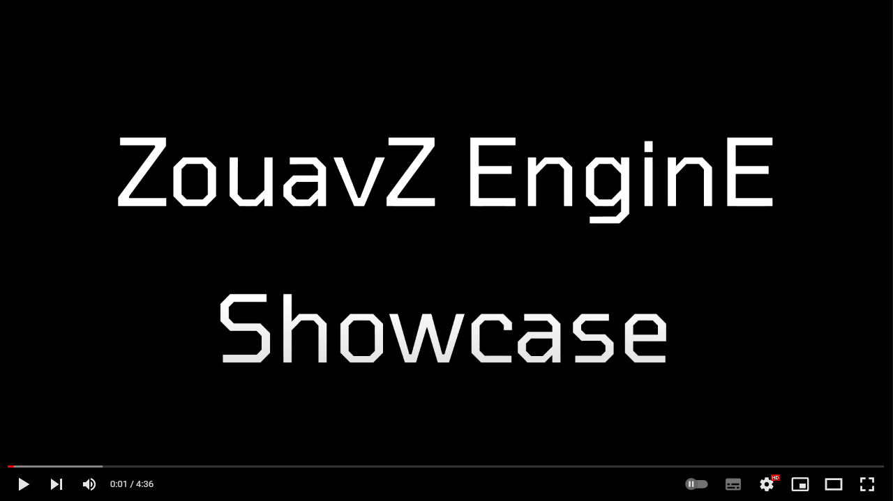

# ZouavZ EnginE

-----

> Programmers :
> Gavelle Antony
> Grondin Jérémy
> Deprez Nicolas

<!--

    

-->

## Features :
- dockable editor windows (Hierarchy, Inspector, Console, Project, Procedural Generation, Scene, Game)
- Move GameObject in the hierarchy with drag and drop
- Create, Edit, Save scenes
- Mesh display with editable textures and shaders
- Editing of components in the inspector
- Prefab creation
- Procedural generation of terrain
- Skybox
- Animation
- PhysX: Rigidbody/RigidStatic and basic collision (box, sphere, capsule), collision detection callback
File creation
- Sounds (spatialized or not)

##Librairie externe : 
Assimp
PhysX4.0
OpenAL
cereal
ImGui
ImGUiGizmos
std_image
glfw
glad
libsndfile

## Execute : 
Run the editor: ReleaseZouavZEnginE.exe
Game: launch the scene in the editor, go to the Project tab, open the Scene folder and press World.zes or press Load

## Known bug
Warning Physx in the console during some operations
When you create a scene and there was already a procedural terrain, the terrain mesh remains in background 

## License :

    MIT License

    Copyright (c) 2020 Grondin Jérémy Gavelle Anthony Deprez Nicolas

    Permission is hereby granted, free of charge, to any person obtaining a copy
    of this software and associated documentation files (the "Software"), to deal
    in the Software without restriction, including without limitation the rights
    to use, copy, modify, merge, publish, distribute, sublicense, and/or sell
    copies of the Software, and to permit persons to whom the Software is
    furnished to do so, subject to the following conditions:

    The above copyright notice and this permission notice shall be included in all
    copies or substantial portions of the Software.

    THE SOFTWARE IS PROVIDED "AS IS", WITHOUT WARRANTY OF ANY KIND, EXPRESS OR
    IMPLIED, INCLUDING BUT NOT LIMITED TO THE WARRANTIES OF MERCHANTABILITY,
    FITNESS FOR A PARTICULAR PURPOSE AND NONINFRINGEMENT. IN NO EVENT SHALL THE
    AUTHORS OR COPYRIGHT HOLDERS BE LIABLE FOR ANY CLAIM, DAMAGES OR OTHER
    LIABILITY, WHETHER IN AN ACTION OF CONTRACT, TORT OR OTHERWISE, ARISING FROM,
    OUT OF OR IN CONNECTION WITH THE SOFTWARE OR THE USE OR OTHER DEALINGS IN THE
    SOFTWARE.
